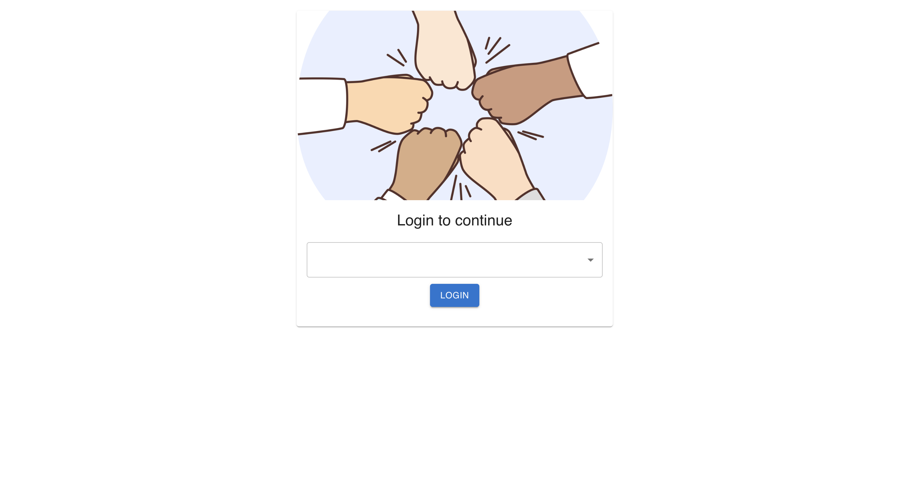

Prepare for the project, you must use:

### `npm install`

The project can be run with: 

### `npm start`

Then it can be test with:

### `npm test`

The project is used for receive opinions from employees, then HR can work with those opinions.



Structure:
```bash
├── README.md - This file.
├── package.json # npm package manager file. It's unlikely that you'll need to modify this.
├── public
│   ├── favicon.ico 
│   └── index.html # DO NOT MODIFY
└── src
    ├── App.css # Styles for app
    ├── App.js # This is the root of app.
    ├── components
    │   ├── Header.js
    │   ├── Home.js
    │   ├── LeaderBoard.js
    │   ├── Login.js
    │   ├── NewPoll.js
    │   ├── Question.js
    │   └── PageNotFound.js
    ├── test
    │   ├── Home.test.js
    │   ├── LeaderBoard.test.js
    │   ├── Login.test.js
    │   ├── NewPoll.test.js
    │   ├── Question.test.js
    ├── asset
    │   ├── _DATA.js # default data from Udacity
    │   ├── 404.png # is used for 404 page 
    │   └── login.png # is used for login page
    ├── middleware
    │   ├── index.js
    │   └── logger.js # log info when receive state changes from UI
    ├── reducer
    │   ├── authUser.js
    │   ├── question.js
    │   ├── users.js
    │   └── index.js
    ├── utils
    │   └── api.js # for calling api
    ├── index.css # Global styles. You probably won't need to change anything here.
    └── index.js # You should not need to modify this file. It is used for DOM rendering only.
```